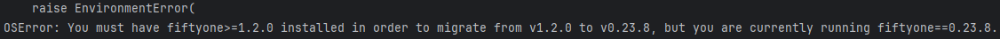
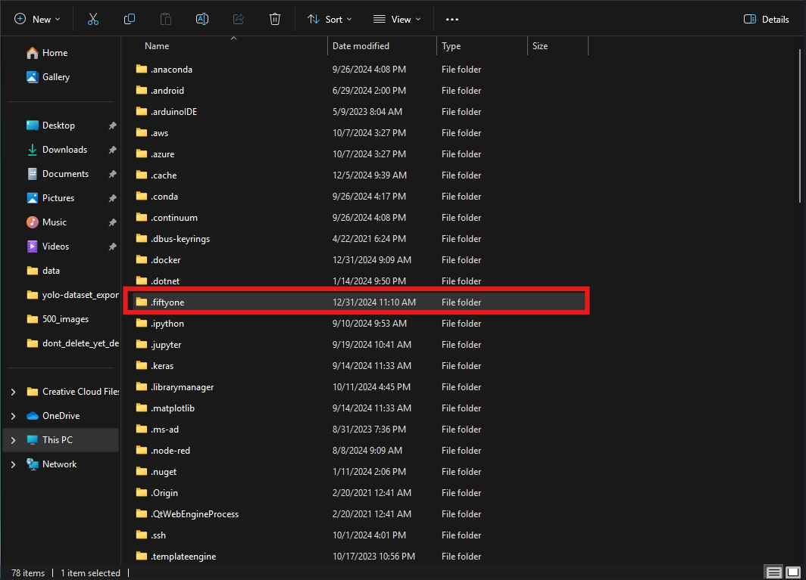
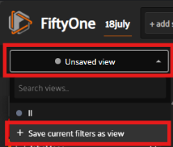
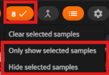
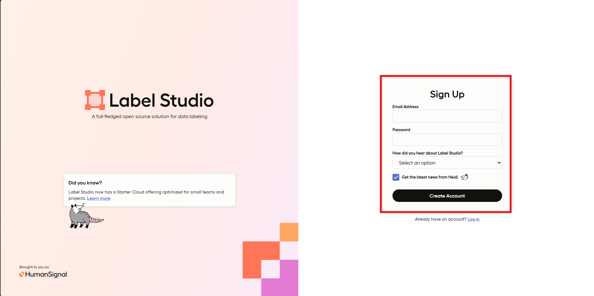
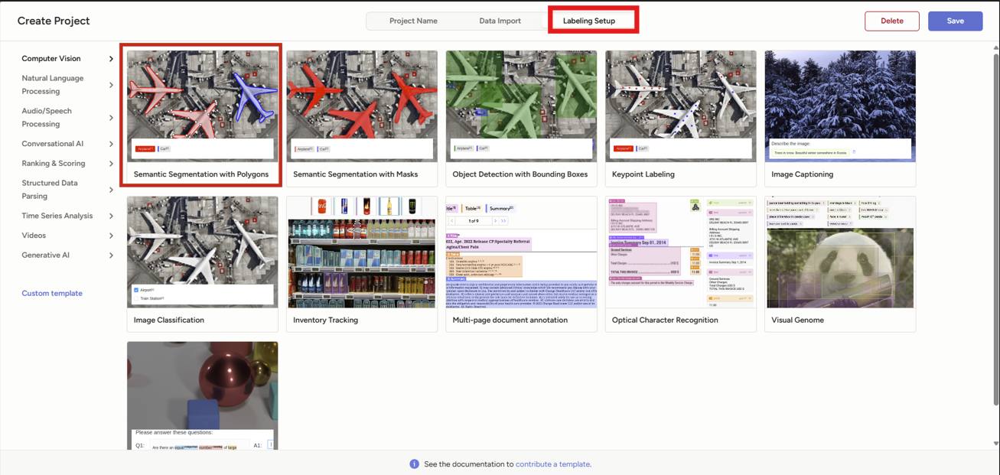
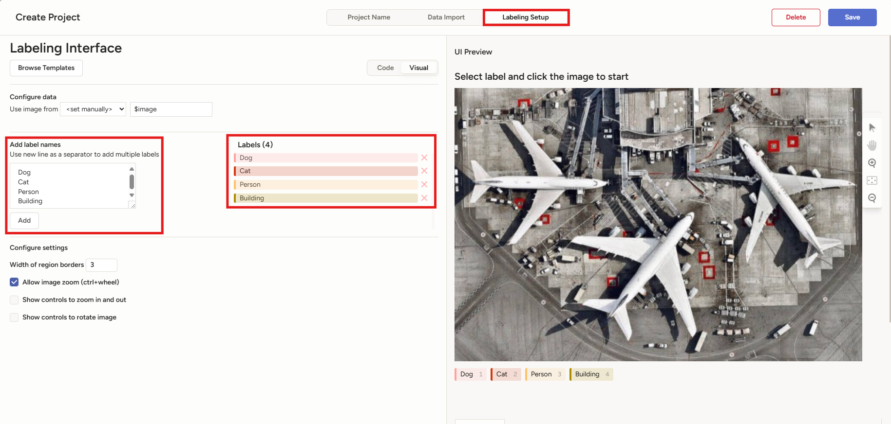
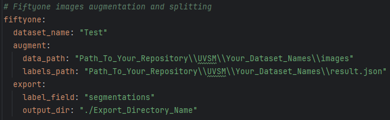

# Under Vehicle Segmentation Model (UVSM)
## Intro
UVSM  is an Under Vehicle Segmentation Model repository, where users can utilize it in order to develop their own working model.

This repository involves 6 different procedures:
1. Data Collection: The main objective in this process is to obtain usable & ideally clean data. 
2. Data Cleaning: Modify data obtained and cleans the data via resizing, cropping and other relevant methods.
3. Data Annotation: Labels the dataset by segmenting the objects inside dataset with respect to its class.
4. Data Augmentation: Artificially expand dataset by using techniques such as manipulating blur, hue, saturation, transformation, etc.
5. Data Training: Trains the dataset according to the configured parameter in order to obtain a working model.
6. Post Training Model Evaluation: Evaluates the capability of the model via tools like GradCAM, YOLO predict and YOLO classify.

Before proceeding, a virtual environment should be created. 

## A. Data Collection
### Pre-requisites
Do ensure the all dependencies have been installed:

```
pip install -r requirements.txt
```



*Note: When faced with such an error, head to `Users` --> `Your_Username` --> `.fiftyone`, delete it and reinstall fiftyone from your environment.



After the libraries have been successfully installed, you may proceed to Data Collection located in:
```
UVSM/scripts/1_Data_Collection.ipynb
```
You will see 6 different cells inside the notebook. Each cell is used for the following purpose:
```
1 - Delete Session: Delete an existing session specified in line 3 (Replace with your dataset name).

2 - List Sessions: List all existing sessions.

3 - Create Session: Creates a brand new session with specified name and dataset directory in line 6 and 7 (Replace with your session name and directory path).
*Note: To access created session, head to localhost:5151 in your browser.*
4 - Load Session: Loads the currently used session to prepare for export (Replace with the session you would like to export in line 4).

5 - Export Images: Exports the images in your current view to the designated directory path in line 6 (Replace with your directory name).
*Note: If NoneType error, click on 'Unsaved view' inside Voxel51 GUI and save it, before trying again.*

6 - Resize Images: Resize images in the designated directory into 640x640 pixels (Recommended)
```
*Note: Always remember to log-in to AIDATASTORAGE, else access is revoked and images wont be imported.*

Once you have finished resizing the exported images, you may proceed to the next phase for data annotation.

Alternatively, for tips in using FiftyOne, you may refer to the following:
```
a. Always utilize the 'Save View' button located on the upper left side of FiftyOne's GUI
```

```
b. Show or Hide Selected Images
- When selecting good images to be exported, utilize the "Only show selected samples"
- On the other hand, when removing bad images from dataset, utilize the "Hide selected samples"
*Note: As mentioned in Part A Cell 5, ONLY CURRENTLY VIEWED SAMPLES will be exported, NOT SELECTED SAMPLES.*
```


For more guides on FiftyOne, visit https://docs.voxel51.com/user_guide/basics.html

## B. Data Annotation
### Pre-requisites
Do ensure the following dependencies have been installed:
- Label Studio

The above packages may be easily installed using:
```
pip install label-studio
```
After the libraries have been successfully installed, you may proceed to launch Label Studio using:
```
label-studio start
```
You will need to sign up for an account.



Once logged in, you can proceed to create a new project by clicking on the blue button on the upper right corner of the page, next to the user profile.

Next, you may proceed with the following:
```
Under Projects Tab,
a. Project Name: Name of the project.
b. Description: Describe your project (optional).
```

```
Under Import Tab,
c. Drag & Drop: Drag the images that you had exported from Part A to Label Studio for Annotation.
```


```
Under Labeling Setup,
d. Select Semantic Segmentation with Polygons.
e. Add label names for the classes you would like to segment, click Save.
```
Alternatively, you could also copy the template code below for labeling setup (polygon tool):
```
<View>

  <Header value="Select label and click the image to start"/>
  <Image name="image" value="$image" zoom="true"/>

  <PolygonLabels name="label" toName="image" strokeWidth="3" pointSize="small" opacity="0.9">
  <Label value="wheel" background="#FFA39E"/>
  <Label value="spare tyre" background="#D4380D"/>
  <Label value="fuel tank" background="#FFC069"/>
  <Label value="catalytic converter" background="#AD8B00"/>
  <Label value="silencer" background="#D3F261"/>
  </PolygonLabels>

</View>
```



After completing the above, you should now be able to annotate the images.
Once you have finished annotating the images:
```
- Click on the Export button on the upper right corner.
- Choose the COCO format to preserve your annotations and proceed to export.
```


## C. Post Annotation Cleaning
After the dataset has been exported as show in Part B, you may proceed to Data Cleaning located in:
```
UVSM/scripts/2_Post_Annotation_Cleaning.ipynb
```
You will see 2 different cells inside the notebook. Each cell is used for the following purpose:
```
1. Rename Images Step 1 (compulsory):
- Adds a unique identifier to the image path inside .JSON file of exported dataset.

2. Rename Images Step 2 (compulsory):
- Joins the full path of the images to form the correct image path inside the .JSON file.
- Prevents missing images when imported into FiftyOne for Augmentation
```

## D. Data Augmentation 

```
# Run the program
python uvsm\main.py
```


*Note: When faced with Pymongo error, you may do the following:
```
# Go to C:\Users\MaxwellLee\PycharmProjects\UVSM\newvenv\Lib\site-packages\pymongo\database.py; add the following line
from pymongo.database_shared import _check_name
```

## Usage

### Augmentation
*Note: You must first configure the config.yml file before starting augmentation.*



More frequent than not, a dataset may be augmented to synthetically generate new data based on existing data. This may be done by employing a number of different techniques such as cropping, and adjusting the hue, brightness, contrast or saturation of the image.

However, augmentation must be applied with caution so as to not expose the model to data that is not an accurate representation of real-world data. For instance, distorting the image too much until the model is unable to identify the presence of a car.

`uvsm` enables augmentation by integrating with `Fiftyone` and `Albumentations`. Though, before proceeding with augmentation, the `config.yml` file must be updated with the paths to the dataset.

To view and augment the dataset:
```Bash
python uvsm\main.py augment
```

### Export

After augmentation, the augmented images must be saved on Fiftyone in order for them to be persisted during export. Otherwise, only the original images will be exported.

The `config.yml` file must be modified to include the path of the output directory and the name of the loaded dataset on Fiftyone's database.

To export the augmented dataset to `COCODetectionDataset` format:
```Bash
python uvsm\main.py export
```
*For more guides on Augmentation, visit https://docs.voxel51.com/tutorials/data_augmentation.html*

## E. Post Augmentation Cleaning
After the dataset has been exported as show in Part B, you may proceed to Data Cleaning located in:
```
UVSM/scripts/3_Post_Augmentation_Cleaning.ipynb
```
You will see 2 different cells inside the notebook. Each cell is used for the following purpose:
```
1. Modify 'iscrowd' Value (optional): Changes the value of 'iscrowd' inside the .JSON file of exported dataset. (Replace with your dataset name & class id in line 5,6 and 11).
- When 'iscrowd' value is set to 1. this implies the segmented class objects are considered a group.
- On the contrary, 'iscrowd' value set to 0 (default) means that the segmented items are not a group. 

2. Modify JSON Double Brackets (compulsory):
- Changes the segmentation array inside JSON file from double brackets to single brackets. *Note: This step is crucial to avoid potential errors.*
```
## F. Data Training
### Split

A dataset should be split to 3 seperate folders, train:test:val, and then structured according to the [YOLO dataset format][yolo-dataset-format] (see [Sample Datasets](#sample-datasets) section).

To split and convert to YOLO format:
```Bash
# python uvsm\main.py split IMAGES LABELS OUTPUT
python uvsm\main.py split ./YOUR_AUGMENTED_DATASET_NAME/data ./YOUR_AUGMENTED_DATASET_NAME/labels.json ./yolo-dataset_YOUR_AUGMENTED_DATASET_NAME
```

After splitting, do the following:
```Bash
# Add test, train and val paths inside dataset.yml
./yolo-dataset_YOUR_AUGMENTED_DATASET_NAME/
├─ test/
├─ train/
├─ val/
├─ dataset.yml (Open this file to edit its content)
```


```Bash
nc: 5
names: [catalytic convertor, fuel tank, silencer, spare tyre, wheel]

# Copy paste the below into your dataset.yml, replace with respective dataset name
test: C:\PATH_TO_YOUR_DIRECTORY\UVSM\yolo-dataset_YOUR_DATASET_NAME\test
train: C:\PATH_TO_YOUR_DIRECTORY\UVSM\yolo-dataset_YOUR_DATASET_NAME\train
val: C:\PATH_TO_YOUR_DIRECTORY\UVSM\yolo-dataset_YOUR_DATASET_NAME\val
```

### Train
Before starting, check if you have installed CUDA, if not: 
https://developer.nvidia.com/cuda-downloads?target_os=Windows&target_arch=x86_64&target_version=11&target_type=exe_network

Afterwards, do the following:
```Bash
#Install necessary libraries for PyTorch with CUDA support:
pip install torch==1.13.0+cu117 torchvision==0.14.0+cu117 torchaudio==0.13.0 -f https://download.pytorch.org/whl/torch_stable.html
```
To start YOLOv8 Training:
```
yolo task=segment mode=train model=yolov8n-seg.pt data=PATH_TO_YOUR_DATASET\dataset.yml epochs=100 imgsz=640 
```
*Note: You may change the default training model and epochs according to your needs.*

Training results can be found in the following location:

```
UVSM/
├─ runs/
   ├─ segment/
       ├─ train/
	   ├─ weights/
	       ├─ best.pt (This is your new model)
	   ├─ args.yaml (Parameters used in training)
	   ├─ results.csv (Results of each epochs detailed)
	   ├─ results.png (Results of training summary in Graphs)
	   ├─ etc...
```
## G. Model Evaluation
### GradCAM
To evaluate model with GradCAM, you can run the following script:
```
UVSM/scripts/4_Model_Evalutation.ipynb
```
You will see 2 different cells inside the notebook. Each cell is used for the following purpose:
```
1. Generate Heatmaps: Generate heatmaps for the different layers using the specified image and models in line 22 & 18.
The generated heatmaps will be saved to the stated directory in line 36. 

2. Display Heatmaps: Display all saved heatmaps in the target directory as seen in line 11.
``` 
## Sample Datasets

COCO dataset should be used for augmentation as it preserves bounding boxes and segmentation masks after importing into Fiftyone for augmentation.
After augmentation, dataset will be exported in the YOLO format.

> Datasets and models can be found in the STA shared drive on the NAS.

Dataset should be in the COCO format when used as input for Fiftyone as follows:

```
coco/
├─ images/
│  ├─ image1.png
├─ result.json

```

Dataset should be in the YOLO format when used as input for YOLOv8 training as follows:

```
yolo/
├─ images/
│  ├─ image1.png
├─ labels/
│  ├─ image1.txt
```

## Contribution

### Pre-commit tool
This project uses the pre-commit tool to maintain code quality and consistency. Before submitting a pull request or making any commits, it is important to run the pre-commit tool to ensure that your changes meet the project's guidelines.

To run the pre-commit tool, follow these steps:

1. Install pre-commit by running the following command: `poetry install`. It will not only install pre-commit but also install all the deps and dev-deps of project

2. Once pre-commit is installed, navigate to the project's root directory.

3. Run the command `pre-commit run --all-files`. This will execute the pre-commit hooks configured for this project against the modified files. If any issues are found, the pre-commit tool will provide feedback on how to resolve them. Make the necessary changes and re-run the pre-commit command until all issues are resolved.

4. You can also install pre-commit as a git hook by execute `pre-commit install`. Every time you made `git commit` pre-commit run automatically for you.

### Docstrings
All new functions and classes in `uvsm` should include docstrings. This is a prerequisite for any new functions and classes to be added to the project.

`uvsm` adheres to the [Sphinx Python docstring style][sphinx-docstring-style]. Please refer to the style guide while writing docstrings for your contribution.

<!-- MARKDOWN LINKS & IMAGES -->
<!-- https://www.markdownguide.org/basic-syntax/#reference-style-links -->
[yolo-dataset-format]: https://docs.ultralytics.com/datasets/segment/#dataset-yaml-format
[sphinx-docstring-style]: https://google.github.io/styleguide/pyguide.html#383-functions-and-methods
